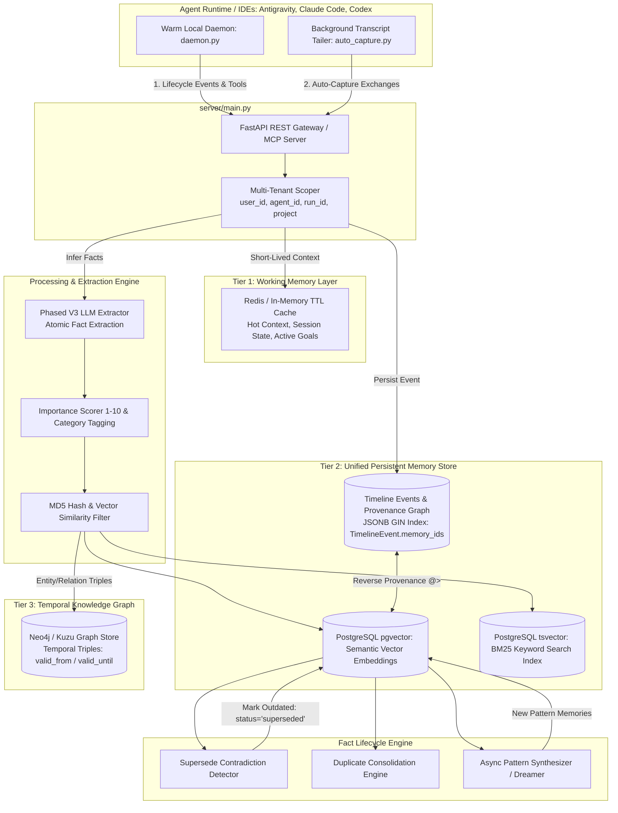

# Master Architecture Blueprint: Unified Persistent Memory Layer

This document defines the **end-to-end architecture** of the self-hosted mem0 persistent memory layer. It synthesizes the parallel capabilities of **mem0** (centralized REST vector store platform), **claude-mem** (activity timeline logging & provenance tracking), and **Mnemosyne (BEAM)** (3-tier memory topology, temporal graph, and hybrid importance/recency-decay search scoring) into a unified, production-grade persistence engine.

---

## 1. System Topology & Architecture Diagram



---

## 2. Multi-Tiered Memory Hierarchy

### Tier 1: Working Memory Layer (Session & Hot Context)
*   **Role**: Manages ephemeral session state (current debugging goals, active file edits, scratchpad notes) with automatic **TTL eviction** (e.g. 2 hours).
*   **Behavior**: Purged upon session termination or TTL expiry to prevent short-lived chatter from polluting permanent long-term memory.
*   **Injection**: Auto-injected into LLM prompts during active sessions.

### Tier 2: Unified Persistent Memory Store (Facts + Vectors + FTS)
*   **Engine**: PostgreSQL with `pgvector` for dense semantic vector embeddings AND `tsvector` with GIN indexing for exact full-text search (FTS).
*   **Scoping**: Enforces strict multi-tenant isolation via `project`, `user_id`, `agent_id`, and `run_id`.
*   **Scoring**: Uses blended hybrid retrieval combining vector similarity, BM25 keyword rank, entity boost, importance rating, and exponential time decay.

### Tier 3: Temporal Knowledge Graph Layer
*   **Role**: Serves point-in-time state queries (*"What was the database schema before commit X?"* or *"Who owned component Y last month?"*).
*   **Triple Schema**: `(Subject, Predicate, Object)` with temporal bounds (`valid_from`, `valid_until`).

---

## 3. Database Schema & Migration Specs (`server/models.py` & Alembic Revision `010`)

### Database Table Extensions
*   `TimelineEvent` (`server/models.py`): Append-only event log augmented with `category` and GIN-indexed `memory_ids` (JSONB).
*   `MemoryRecord` Payload Attributes:
    *   `importance` (Integer, 1–10 scale, default `5`): Fact importance weight.
    *   `category` (String, index): `decision`, `bug_fix`, `architecture`, `user_preference`, `task_learning`.
    *   `status` (String, index): `"active"`, `"superseded"`, or `"merged"`.
    *   `superseded_by_id` (UUID): Reference to the replacing memory ID.

### Migration Revision `010`
Located at `server/alembic/versions/010_memory_supersede_and_importance.py`.

---

## 4. The 4 Core Implementation Engines

### Engine 1: 🔄 Supersede Contradiction Resolver
Implemented in `Memory._supersede_contradictions` and `AsyncMemory._supersede_contradictions`:
1. On memory insertion, scans existing memories in the same tenant scope with vector similarity $\text{sim} \ge 0.85$.
2. Marks contradicted facts as `status = "superseded"` and sets `superseded_by_id = new_memory_id`.
3. Standard queries (`Memory.search`, `Memory.get_all`) filter out superseded facts via `_payload_is_superseded`.

```
                       ┌────────────────────────────────────────┐
                       │           New Fact Ingested            │
                       └───────────────────┬────────────────────┘
                                           │
                                           ▼
                       ┌────────────────────────────────────────┐
                       │     Supersede Contradiction Check      │
                       │ Vector Search (sim > 0.85) + LLM Check │
                       └───────────────────┬────────────────────┘
                                           │
                        ┌──────────────────┴──────────────────┐
                        ▼                                     ▼
             [Contradiction Found]                  [No Contradiction]
                        │                                     │
                        ▼                                     ▼
        Mark Old Fact: status="superseded"            Insert New Fact as
        Set superseded_by_id = new_fact.id            status="active"
```

### Engine 2: ⚡ Blended Hybrid Search Scoring Engine
Implemented in `mem0/utils/scoring.py#score_and_rank`:

$$\text{FinalScore} = \min\left(1.0, \, \frac{\text{VectorSim} + \text{BM25} + \text{EntityBoost} + 0.3 \cdot \text{Importance} + 0.2 \cdot \text{Recency}}{\text{MaxPossible}}\right)$$

*   **Recency Decay Formula**:
    $$\text{RecencyScore} = \exp\left(-\frac{\Delta t}{30.0}\right)$$
    where $\Delta t$ is the age of the fact in days.

### Engine 3: ⏱️ Working Memory Tier (Session TTL Cache)
* Short-lived session notes and debugging hypotheses are cached in memory/Redis with a 2-hour TTL.

### Engine 4: 🔗 Bidirectional Provenance Links
* Uses the GIN index on `TimelineEvent.memory_ids` (`server/models.py`).
* **Forward Link**: `TimelineEvent` $\rightarrow$ `memory_ids`
* **Reverse Link**: Memory ID $\rightarrow$ `GET /timeline/events/for-memory/{id}` using PostgreSQL JSONB containment (`@>`).

---

## 5. Plugin & Hook Integration (Codex, Antigravity, Claude Code)

- **Local Daemon (`integrations/mem0-plugin/scripts/daemon.py`)**: Warm daemon process operating on localhost with atomic per-request environment isolation (`_dispatch_lock`) and stat-based fingerprinting for auto-recycling.
- **Rubric Guidance (`integrations/mem0-plugin/scripts/_handlers.py`)**: Prompts agents during sessions to attach `importance` (1–10) and `category` tags (`decision`, `bug_fix`, `architecture`, `user_preference`, `task_learning`) when calling `add_memory`.
- **Auto-Capture (`integrations/mem0-plugin/scripts/auto_capture.py`)**: Background transcript tailer running every 3rd message, populating `category="auto_capture"` and `importance=6`.

---

## 6. Verification Suite Commands

```bash
# Core Scoring & Memory Unit Tests
uv run pytest tests/utils/test_scoring.py tests/memory/test_main.py

# MCP Plugin Suite
env -u MEM0_API_MODE -u MEM0_API_URL -u MEM0_API_KEY uv run pytest integrations/mem0-plugin/tests/

# Linter Verification
uv run ruff check mem0/ server/ integrations/mem0-plugin/
```
