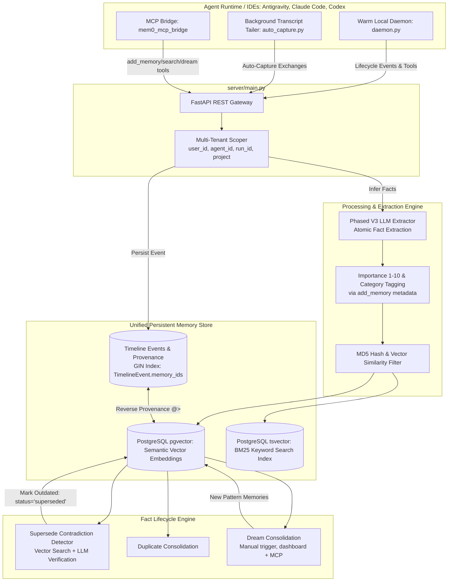

# Master Architecture Blueprint: Unified Persistent Memory Layer

This document describes the self-hosted mem0 persistent memory layer. It draws on ideas from **mem0** (centralized REST vector store platform), **claude-mem** (activity timeline logging & provenance tracking), and **Mnemosyne (BEAM)** (multi-tier memory topology, temporal graph, and hybrid importance/recency-decay search scoring).

It is split into two sections: **Implemented** (built, tested, and wired end-to-end through code/MCP/API/dashboard) and **Roadmap** (design ideas not yet started). Do not treat anything in the Roadmap section as delivered.

---

## 1. Implemented Architecture



### Persistent Memory Store (Facts + Vectors + FTS)
*   **Engine**: PostgreSQL with `pgvector` for dense semantic vector embeddings AND `tsvector` with GIN indexing for exact full-text search (FTS).
*   **Scoping**: Enforces multi-tenant isolation via `project`, `user_id`, `agent_id`, and `run_id`.
*   **Scoring**: Blended hybrid retrieval combining vector similarity, BM25 keyword rank, entity boost, importance rating, and exponential time decay.

### Schema

`memories` table (managed entirely by `mem0/vector_stores/pgvector.py`, outside Alembic — Alembic only governs the separate `mem0_app` database's own tables like `users`/`timeline_events`/`memory_exports`):
*   `importance` (payload int, 1–10 scale, default `5`): fact importance weight, used by the scoring engine.
*   `category` (payload string, free-form, e.g. `decision`, `bug_fix`, `architecture`, `user_preference`, `task_learning`).
*   `status` (payload string, btree-indexed via `_ensure_status_index`): `"active"`, `"superseded"`, or `"merged"`.
*   `superseded_by_id` / `merged_into_id` (payload string): lineage links.

### Engine 1: Supersede Contradiction Resolver
Implemented in `Memory._supersede_contradictions` / `AsyncMemory._supersede_contradictions` (`mem0/memory/main.py`):
1. On memory insertion, scans existing memories in the same tenant scope with vector similarity ≥ 0.85.
2. Asks the LLM (`_llm_confirms_contradiction`) to confirm the candidate actually contradicts the new fact — vector similarity alone never marks something superseded. Fails closed: any LLM error leaves the existing memory untouched.
3. Marks contradicted facts as `status = "superseded"` and sets `superseded_by_id = new_memory_id`.
4. `Memory.search` / `Memory.get_all` filter out superseded facts by default via `_payload_is_superseded`; pass `show_superseded=True` to include them (mirrors the existing `show_expired` convention).

```
                       ┌────────────────────────────────────────┐
                       │           New Fact Ingested            │
                       └───────────────────┬────────────────────┘
                                           │
                                           ▼
                       ┌────────────────────────────────────────┐
                       │     Supersede Contradiction Check      │
                       │ Vector Search (sim > 0.85) + LLM Check │
                       └───────────────────┬────────────────────┘
                                           │
                        ┌──────────────────┴──────────────────┐
                        ▼                                     ▼
             [Contradiction Confirmed]                [No Contradiction /
                        │                            LLM Check Failed]
                        ▼                                     ▼
        Mark Old Fact: status="superseded"            Insert New Fact as
        Set superseded_by_id = new_fact.id            status="active"
```

### Engine 2: Blended Hybrid Search Scoring Engine
Implemented in `mem0/utils/scoring.py#score_and_rank`. `max_possible` (the denominator) is computed once per search batch from which signals are actually present across all candidates, so two candidates with identical semantic/BM25/entity signals always get the same denominator regardless of which one happens to carry an `importance` or recency timestamp.

$$\text{FinalScore} = \min\left(1.0, \, \frac{\text{VectorSim} + \text{BM25} + \text{EntityBoost} + 0.3 \cdot \text{Importance} + 0.2 \cdot \text{Recency}}{\text{MaxPossible}}\right)$$

*   **Recency Decay Formula**:
    $$\text{RecencyScore} = \exp\left(-\frac{\Delta t}{30.0}\right)$$
    where $\Delta t$ is the age of the fact in days.

### Engine 3: Dream Consolidation
Manual, on-demand consolidation (`Memory.dream()`), triggered via `POST /memories/dream`, the dashboard's Dream page (with a type-to-confirm modal, since it's a bulk write), or the MCP `dream_consolidate` tool. Clusters near-duplicate active memories by vector similarity and merges them into synthesized memories, setting `status="merged"` / `merged_into_id` on the sources. This is **not** a background job — nothing runs it automatically on a schedule.

### Engine 4: Bidirectional Provenance Links
* Uses the GIN index on `TimelineEvent.memory_ids` (`server/models.py`).
* **Forward Link**: `TimelineEvent` → `memory_ids`
* **Reverse Link**: Memory ID → `GET /timeline/events/for-memory/{id}` using PostgreSQL JSONB containment (`@>`).

### Plugin & Hook Integration (Codex, Antigravity, Claude Code)

- **Local Daemon (`integrations/mem0-plugin/scripts/daemon.py`)**: Warm daemon process operating on localhost with atomic per-request environment isolation (`_dispatch_lock`) and stat-based fingerprinting for auto-recycling.
- **Rubric Guidance (`integrations/mem0-plugin/scripts/_handlers.py`)**: Prompts agents during sessions to attach `importance` (1–10) and `category` tags when calling `add_memory`.
- **Auto-Capture (`integrations/mem0-plugin/scripts/auto_capture.py`)**: Background transcript tailer running every 3rd message, populating `category="auto_capture"` and `importance=6`.
- **MCP Bridge (`server/mcp/mem0_mcp_bridge`)**: `add_memory` accepts `importance`/`category` directly; `search_memories`/`get_memories` accept `show_superseded`; `dream_consolidate` exposes the Dream engine as a tool.

### Verification

```bash
# Core Scoring & Memory Unit Tests
uv run pytest tests/utils/test_scoring.py tests/memory/test_main.py tests/vector_stores/test_pgvector.py

# MCP Bridge Suite
uv run pytest tests/test_mem0_mcp_bridge.py

# MCP Plugin Suite
env -u MEM0_API_MODE -u MEM0_API_URL -u MEM0_API_KEY uv run pytest integrations/mem0-plugin/tests/

# Linter Verification
uv run ruff check mem0/ server/ integrations/mem0-plugin/
```

---

## 2. Roadmap (Not Implemented)

These are design directions worth considering, borrowed from Mnemosyne's tiered topology. None of this exists in code today — no Redis, no graph store, no TTL cache. Treat this section as ideas to evaluate, not architecture in place.

### Working Memory Layer (Session & Hot Context)
Idea: an ephemeral, TTL-evicted cache (e.g. Redis, 2-hour TTL) for short-lived session state — active debugging goals, scratchpad notes — auto-injected into prompts without polluting long-term memory. Would need its own eviction policy, a decision on what belongs here vs. going straight to Tier 2, and a way to promote working-memory items into permanent facts.

### Temporal Knowledge Graph Layer
Idea: a `(Subject, Predicate, Object)` triple store with temporal bounds (`valid_from`, `valid_until`) — e.g. Neo4j or Kuzu — to answer point-in-time queries like "what was the schema before commit X" or "who owned component Y last month." Would need an entity/relation extraction step feeding it (today's `DedupEngine` only extracts flat facts, not relation triples) and a query surface (API + dashboard) that doesn't exist yet.
